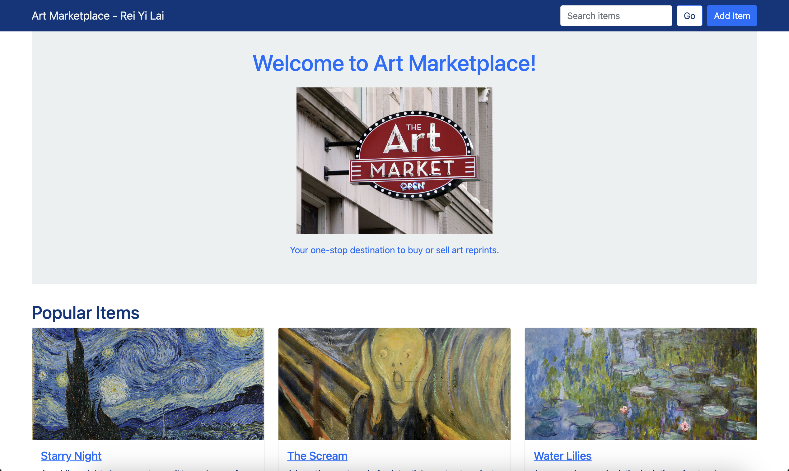

# Art Gallery Web App

A simple Flask-based web application to browse, add, and search artwork items.

## Demo

<p align="center">
    <a href="https://youtu.be/0JqHv9J5On4">
        
    </a>
</p>

## Prerequisites

- Python 3.x
- Flask

## Installation

```bash
pip install Flask
```

## Usage

```bash
python3 server.py
``` 

Open your browser and visit `http://127.0.0.1:5001`

## Project Structure

- `server.py`: Flask application
- `templates/`: HTML templates
- `static/`: CSS and JavaScript assets
